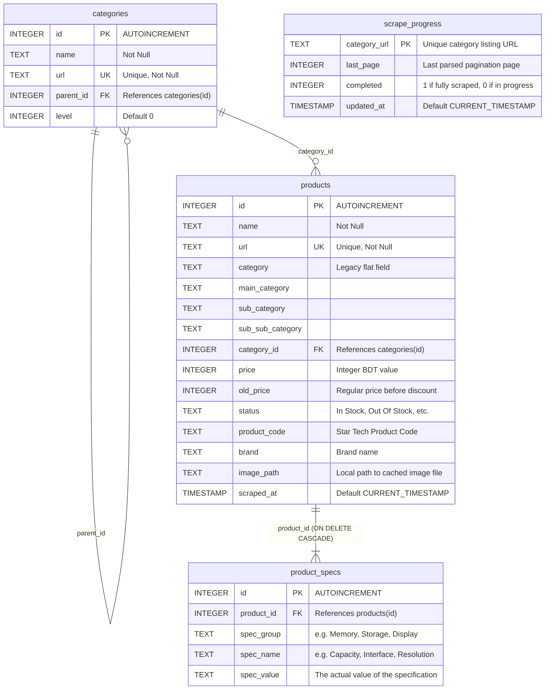

# Star Tech Scraper Database Schema

This document details the SQLite database structure (`startech.db`) used by the scraper. You can use this schema reference to integrate the scraped product catalog into your ERP or other software projects.

## Overview
* **Database Type**: SQLite 3
* **File Name**: `startech.db`
* **Default Port / Access**: Can be accessed concurrently in read-only mode (`file:startech.db?mode=ro`) to prevent locking issues during scrapers runs.

---

## Entity Relationship Diagram



---

## Table Definitions

### 1. `categories`
Stores the hierarchical category tree parsed from Star Tech's navigation menu. Supports up to 3 levels deep (Main > Sub > Sub-Sub).

| Column | Type | Constraints | Description |
| :--- | :--- | :--- | :--- |
| `id` | `INTEGER` | `PRIMARY KEY AUTOINCREMENT` | Unique identifier for the category. |
| `name` | `TEXT` | `NOT NULL` | The user-friendly name of the category (e.g. `Graphics Card`). |
| `url` | `TEXT` | `UNIQUE NOT NULL` | The canonical Star Tech URL for the category listing. |
| `parent_id` | `INTEGER` | `FOREIGN KEY` | References `categories(id)`. Null for top-level categories. |
| `level` | `INTEGER` | `DEFAULT 0` | Nesting level: `0` (Main Category), `1` (Sub Category), `2` (Sub-Sub Category). |

### 2. `products`
Stores the parsed product metadata, canonical categorization fields, prices, and status.

| Column | Type | Constraints | Description |
| :--- | :--- | :--- | :--- |
| `id` | `INTEGER` | `PRIMARY KEY AUTOINCREMENT` | Unique identifier for the product. |
| `name` | `TEXT` | `NOT NULL` | The full product title/name. |
| `url` | `TEXT` | `UNIQUE NOT NULL` | The source page URL of the product. |
| `category` | `TEXT` | - | Legacy flat category column. |
| `main_category` | `TEXT` | - | Level 0 category name (e.g. `Component`). |
| `sub_category` | `TEXT` | - | Level 1 category name (e.g. `RAM`). |
| `sub_sub_category` | `TEXT` | - | Level 2 category name (e.g. `DDR5 RAM`). |
| `category_id` | `INTEGER` | `FOREIGN KEY` | References the specific leaf `categories(id)`. |
| `price` | `INTEGER` | - | Current price in BDT. Null/0 represents "Call for Price". |
| `old_price` | `INTEGER` | - | Original/Regular price in BDT if discounted. |
| `status` | `TEXT` | - | Availability status (e.g., `In Stock`, `Out Of Stock`, `Pre Order`, `Up Coming`). |
| `product_code` | `TEXT` | - | Star Tech's unique model/product code. |
| `brand` | `TEXT` | - | Brand name of the product (e.g. `ASUS`, `Intel`). |
| `image_path` | `TEXT` | - | Local file system path to the downloaded product image. |
| `scraped_at` | `TIMESTAMP` | `DEFAULT CURRENT_TIMESTAMP` | Date and time when the product was first scraped. |

### 3. `product_specs`
Stores the detailed technical specifications of products in a key-value format grouped by specification sections.

| Column | Type | Constraints | Description |
| :--- | :--- | :--- | :--- |
| `id` | `INTEGER` | `PRIMARY KEY AUTOINCREMENT` | Unique identifier. |
| `product_id` | `INTEGER` | `NOT NULL`, `FOREIGN KEY` | References `products(id)` with `ON DELETE CASCADE`. |
| `spec_group` | `TEXT` | - | Group heading under which this spec is listed (e.g. `Key Features`, `Warranty`). |
| `spec_name` | `TEXT` | `NOT NULL` | The specification attribute name (e.g. `Capacity`, `Frequency`). |
| `spec_value` | `TEXT` | `NOT NULL` | The value of the specification. |

### 4. `scrape_progress`
Internal table used by the scraper to track progress and safely resume operations after shutdowns.

| Column | Type | Constraints | Description |
| :--- | :--- | :--- | :--- |
| `category_url` | `TEXT` | `PRIMARY KEY` | The unique leaf category URL being crawled. |
| `last_page` | `INTEGER` | `DEFAULT 0` | The last pagination page successfully parsed. |
| `completed` | `INTEGER` | `DEFAULT 0` | Set to `1` if all pages for this category are done, else `0`. |
| `updated_at` | `TIMESTAMP` | `DEFAULT CURRENT_TIMESTAMP` | Last updated timestamp. |

---

## Example Queries for ERP Integration

### A. Fetching a Product with All Specifications
This query returns a product alongside its specific technical attributes (ordered by group and name).

```sql
SELECT 
    p.id AS product_id,
    p.name,
    p.brand,
    p.product_code,
    p.price,
    p.status,
    s.spec_group,
    s.spec_name,
    s.spec_value
FROM products p
LEFT JOIN product_specs s ON p.id = s.product_id
WHERE p.product_code = '19842'  -- Replace with desired product code
ORDER BY s.spec_group, s.spec_name;
```

### B. Recursive Category Tree Traversal
This recursive Common Table Expression (CTE) query rebuilds the hierarchical path for all categories in the tree.

```sql
WITH RECURSIVE category_path AS (
    -- Anchor member: Select top-level categories (Level 0)
    SELECT id, name, parent_id, name AS full_path
    FROM categories
    WHERE parent_id IS NULL
    
    UNION ALL
    
    -- Recursive member: Link subcategories to parent path
    SELECT c.id, c.name, c.parent_id, cp.full_path || ' > ' || c.name
    FROM categories c
    JOIN category_path cp ON c.parent_id = cp.id
)
SELECT id, name, full_path 
FROM category_path
ORDER BY full_path;
```

### C. Find Products by Parent Category (Recursive Lookup)
If you want to query all products belonging to a main category (e.g., "Component") and any of its subcategories recursively:

```sql
WITH RECURSIVE subcategories AS (
    SELECT id FROM categories WHERE name = 'Component'
    UNION ALL
    SELECT c.id FROM categories c
    JOIN subcategories s ON c.parent_id = s.id
)
SELECT p.id, p.name, p.brand, p.price, p.main_category, p.sub_category 
FROM products p
WHERE p.category_id IN (SELECT id FROM subcategories);
```

### D. Exporting Products JSON Payload
Constructs a flat, clean catalog query suitable for directly converting to an ERP JSON payload:

```sql
SELECT 
    p.product_code AS sku,
    p.name AS title,
    p.brand,
    p.price,
    p.old_price,
    p.status AS availability,
    p.main_category || ' > ' || COALESCE(p.sub_category, '') || ' > ' || COALESCE(p.sub_sub_category, '') AS category_path,
    p.image_path,
    p.url AS source_url
FROM products p
WHERE p.status = 'In Stock' AND p.price > 0;
```
